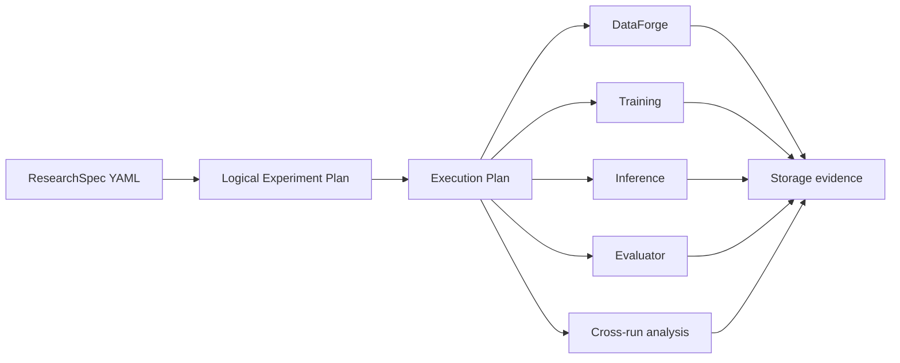

# Architecture

The research file describes what must be learned. This frozen intent is called
the **research specification** (`ResearchSpec`). The logical plan expands its
treatments and seeds without deciding how many workers exist. Only the
execution plan decides ordering, dependencies, retries, and resource grouping.

Resource owns tenant, project, workspace, principal, context, run, and
correlation identity. Experiments keeps hypothesis, research-question,
treatment, and seed values as research metadata. Observability records what
happened but does not interpret those research concepts.

The current executor is conservative and synchronous. It groups all training
before one shared inference-service window, so compatible adapters can reuse a
resident base model. Component gateways are typed and operation-specific; this
is not a general Python workflow or plugin engine.
