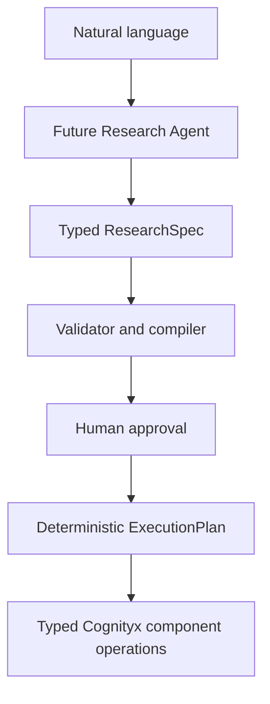
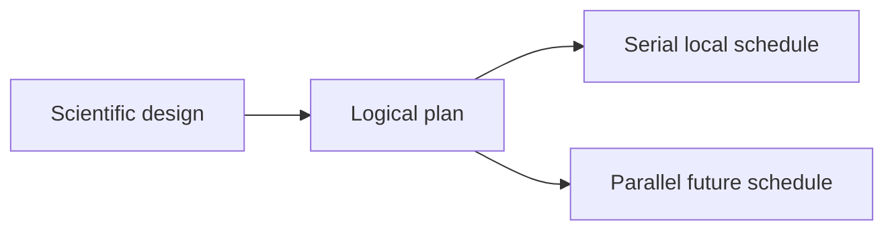

# Future Research Agent

The current target is Level 0: a human authors a declarative, deterministic
research specification and the compiler produces a validated plan.

The safe boundary is never “agent to arbitrary shell to GPU.” Scientific design
and hardware scheduling remain separate.

- Level 0 — current: declarative deterministic `ResearchSpec`.
- Level 1: natural-language research-plan drafting.
- Level 2: the agent proposes hypotheses, questions, treatments, outcomes,
  estimands, and stopping rules, then compiles them into the typed schema.
- Level 3: the agent proposes an execution DAG and Mermaid view for human edit
  and approval.
- Level 4: bounded adaptive experimentation proposes a next experiment from
  accumulated evidence; a human must approve it.
- Level 5: a governed Research Agent manages an iterative program under explicit
  budgets, policy, and approvals.

Changing from one local GPU to several workers changes scheduling, not the
preregistered treatment, estimand, or outcome. No agent framework is introduced
by the current implementation.
