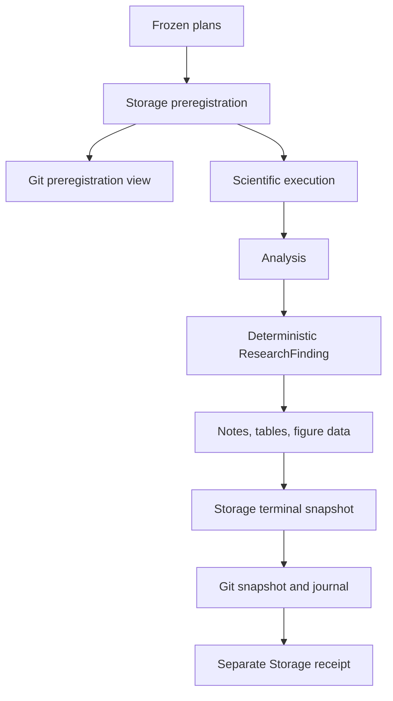

# Research publication

Research publication happens twice. Immediately before component execution,
the system freezes the research specification, logical plan, execution plan,
treatments, seeds, outcomes, analyses, and stopping rule. This is the
preregistration snapshot. After evaluation and cross-run analysis, it creates a
terminal snapshot containing lineage references, statistics, a
`ResearchFinding`, a factual note, tables, and figure-ready data.

Storage is authoritative. Git receives only explicitly named files. Snapshot
IDs hash canonical file metadata, and existing snapshot directories are
immutable. Corrections use `supersedes_snapshot_id`.

A Git push failure sets `git_publication_status=pending_retry`; it does not
change completed scientific or analysis status. Resume retries publication
without invoking completed component steps. A separate receipt records the Git
repository, commit, path, and snapshot ID without changing the frozen manifest.

The normal public repository policy is `sanitized`. Full and metadata-only
policies are also supported. Secret-shaped keys, environment blocks, user-home
paths, and temporary paths are always redacted.
