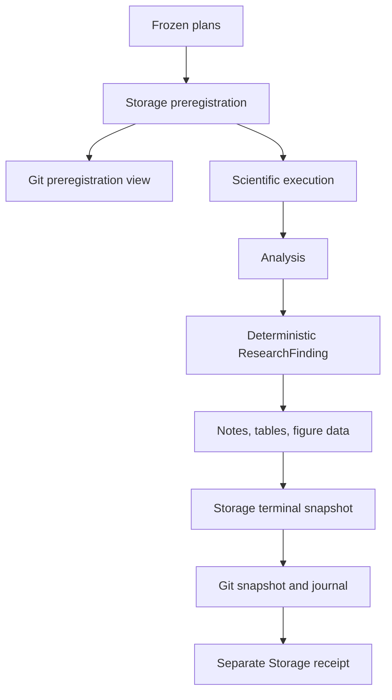

# Research publication

Research publication happens twice. Immediately before component execution,
the system freezes the research specification, logical plan, execution plan,
treatments, seeds, outcomes, analyses, and stopping rule. This is the
preregistration snapshot. After evaluation and cross-run analysis, it creates a
terminal snapshot containing lineage references, statistics, a
`ResearchFinding`, a factual note, tables, and figure-ready data.

Storage is authoritative. Git receives only explicitly named files. Snapshot
IDs hash canonical file metadata, and existing snapshot directories are
immutable. Corrections use `supersedes_snapshot_id`.

Version 1 uses one local Git writer at a time. Before writing, the publisher
checks the expected results repository and requires a clean working tree. When
push is enabled it fetches and performs a fast-forward-only pull. It tracks and
stages each file written by the current transaction, then verifies that no
other path entered the index. Divergence or a push race leaves publication in
`pending_retry` without changing the scientific result.

A Git push failure sets `git_publication_status=pending_retry`; it does not
change completed scientific or analysis status. Resume retries publication
without invoking completed component steps. A separate receipt records the Git
repository, commit, path, and snapshot ID without changing the frozen manifest.

The normal snapshot content policy is `sanitized`. Full and metadata-only
policies are also supported. Structured records are recursively sanitized
before they are converted to JSON Lines (`records.jsonl`). Credential keys,
environment blocks, user-home paths, and temporary paths are always redacted;
token counts and tokenizer revisions remain available for reproducibility.
