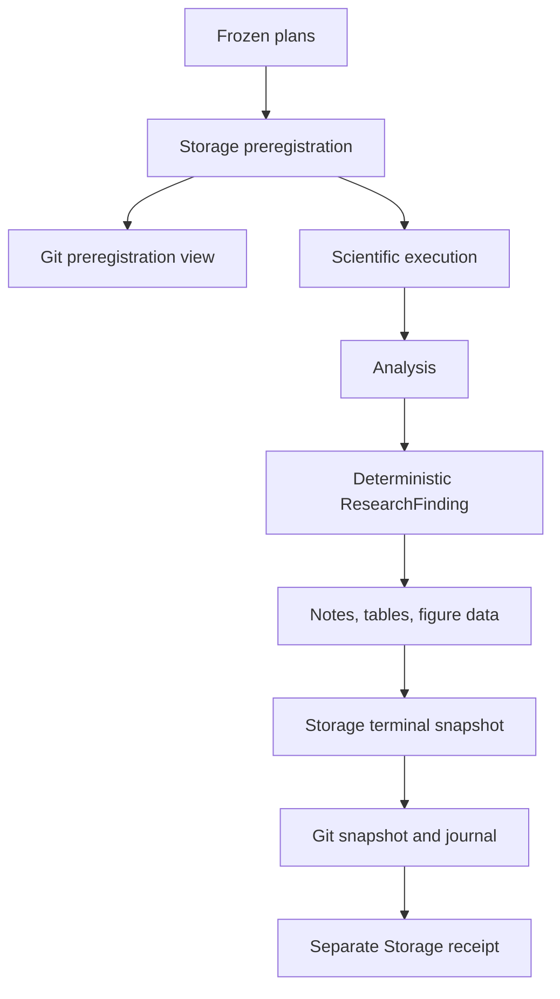

# Research publication

Research publication happens twice. Immediately before component execution,
the system freezes the research specification, logical plan, execution plan,
treatments, seeds, outcomes, analyses, and stopping rule. This is the
preregistration snapshot. After evaluation and cross-run analysis, it creates a
terminal snapshot containing lineage references, statistics, a
`ResearchFinding`, a factual note, tables, and figure-ready data.



Storage is authoritative. Git receives only explicitly named files. Snapshot
IDs hash canonical file metadata, and existing snapshot directories are
immutable. Corrections use `supersedes_snapshot_id`.

## Safe-public policy

The research YAML freezes where a Git copy may be published and how much of the
evidence may appear there. This rule is the publication policy
(`experiment.execution.publication`). Because it is part of the research YAML,
changing it changes the research-specification checksum.

```yaml
execution:
  publication:
    repository: cognityx/cognityx-experiment-results
    repository_visibility_policy: public_summary
    data_classification: public
    content_policy: sanitized
```

Omitting the policy is conservative. It means `private_required`, an
`unspecified` data classification, and `sanitized` content. A public repository
is permitted only when the frozen policy says `public_summary` and the data is
classified `public`. A command-line switch cannot weaken this rule.

The public summary is built from a small list of approved fields. It is not a
redacted copy of the full evidence. This construction keeps research
identities, hypotheses, question IDs, treatment roles, seeds, outcome rules,
model and tokenizer revisions, checksums, aggregate statistics, aggregate
resource counts, findings, and figure-ready values. For example, it may report
that a run used 204 prompt tokens in total, but it never publishes the prompts.

The public Git view excludes individual records (`records.jsonl`), raw source
passages, prompts, candidate or reference answers, generated responses, tokens
or other credentials, local paths, private Storage addresses, environment
details, and private model or tokenizer files. The writer checks every public
snapshot and journal value before a Git transaction. If an unexpected field or
private location reaches that boundary, publication fails closed.

An internal, confidential, restricted, or unspecified experiment cannot use a
public repository. It belongs in a separately governed private repository or
must remain only in Storage. Even when the destination repository is private,
selecting `public_summary` still uses the strict summary projection; repository
privacy never expands what that policy publishes.

Version 1 uses one local Git writer at a time. Before writing, the publisher
checks the expected results repository and requires a clean working tree. When
push is enabled it fetches and performs a fast-forward-only pull. It tracks and
stages each file written by the current transaction, then verifies that no
other path entered the index. Divergence or a push race leaves publication in
`pending_retry` without changing the scientific result.

A Git push failure sets `git_publication_status=pending_retry`; it does not
change completed scientific or analysis status. Resume retries publication
without invoking completed component steps. A separate receipt records the Git
repository, commit, path, and snapshot ID without changing the frozen manifest.

For a policy that requires a private repository, the normal snapshot content
policy is `sanitized`. `full` and `metadata_only` are also supported there.
Structured records are recursively sanitized before conversion to JSON Lines
(`records.jsonl`). Credential keys, environment blocks, user-home paths, and
temporary paths are always redacted. The strict public-summary path does not
publish those records at all.
